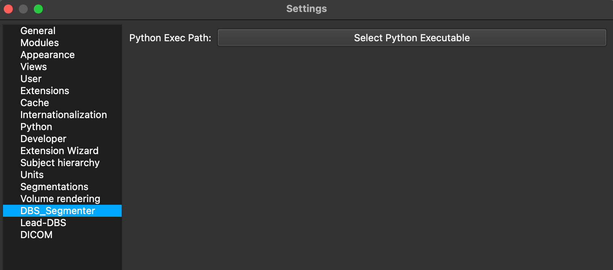
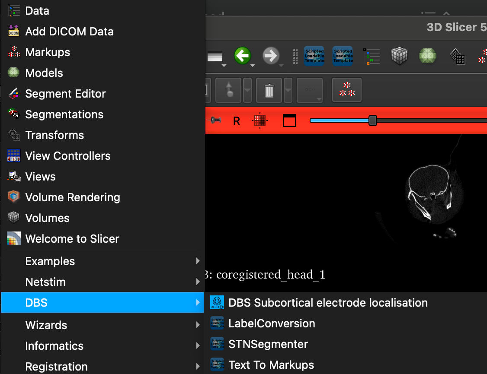
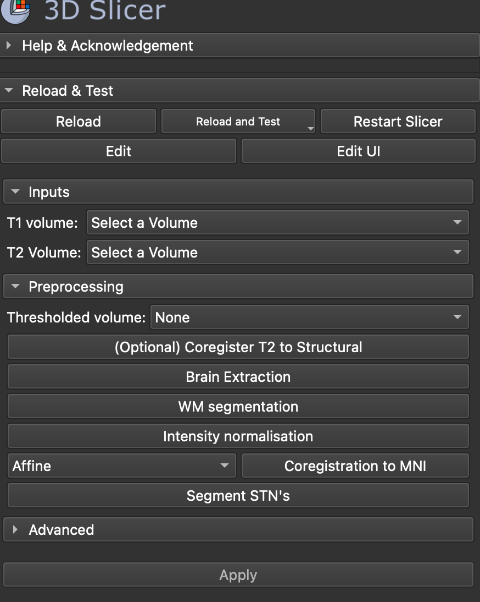
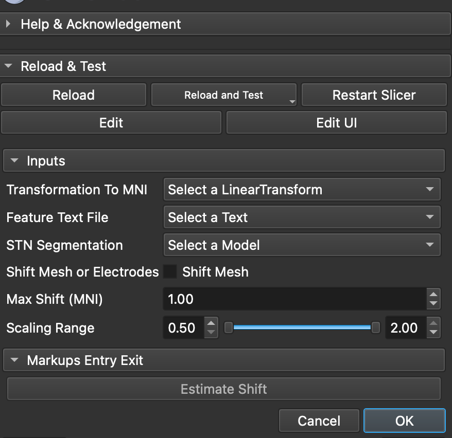

## Install Instructions

### Windows

1. Clone the repository:
    ```sh
    git clone https://github.com/your-repo/slicerMER.git
    cd slicerMER
    ```

2. Create a virtual environment and activate it:
    ```sh
    python -m venv venv
    .\venv\Scripts\activate
    ```

3. Install the required dependencies:
    ```sh
    pip install -r requirements.txt
    ```

4. Run the application:
    ```sh
    python main.py
    ```

### macOS

1. Install plugin
2. Setup python environment using any method you prefer (conda or virtualenv)
As long as embeded 3d Slicer python does not support tensorflow, you need to install it in your environment.
    ```sh
    pip install tensorflow
    ```
   install antspynet
   ```sh 
   pip install antspynet
   ```
3. In Slicer Settings set the python environment to the one you have installed the dependencies.



## Usage Instructions

All modules are accessible from the DBS menu in 3D Slicer
### Segmentation module (STNSegmenter)
1. Open the STN semgenter module from the DBS menu.
You will see the following interface of the module:

2. Select the input T1 and T2 images which were loaded into 3D slicer.
It is recommended to have the T1 and T2 images already registered. As internal coregistration could be not perfect.
3. Run the Brain Extraction as the first step. This will extract the brain from the T1 image.
4. Run the WM segmentation. This will segment the white matter from the T1 image.
5. Run the intensity normalization. This will normalize the intensity of T2 image.
6. Choose Coregistration menthod to MNI space. This will coregister the T1 image to MNI space.
It is recommended to use the Affine or Similarity transformation.
7. Run the coregistration. This will coregister the T1 image to MNI space.
8. Run the STN segmentation. This will segment the STN from the T2 image in MNI space and return the segmentations in form of a 3D mesh.
9. The output will be displayed in the 3D slicer viewer.

### DBS Subcortical electrode localisation module
Module is integrated with Lead-OR module from Netsim thus relies on proper setup and work of it.
Please follow Netsim documentation to setup the Lead-OR module.
Further in Lead-OR module you need to toggle export XYZ in features window there for a proper work.
1. Open the DBS electrode localisation module from the DBS menu.

2. Select the input transformation to MNI space. This is necessary to have as we do all computations in MNI space.
3. Select the input electrode features file. This is the output of the Lead-OR module.
4. Select the STN Mesh. This is the output of the STN segmentation module or manual segmentation converted to 3D mesh.
5. (Optional) Chose transform mesh or Electrodes (by default it is set to transform electrodes).
6. (Optional) Chose max shift in mnispace (to limit the search space for the electrodes).
7. (Optional) Chose the scaling range (default is 0.8-1.2).
8. Run the electrode localisation. 
This will transform the Electrodes/Mesh according to your maximum shift and scaling 
range and return and visualise transformation + classification of the electrodes which will be visible in the Lead-OR module for selection.


"
## License

This project is licensed under the MIT License - see the `LICENSE` file for details.